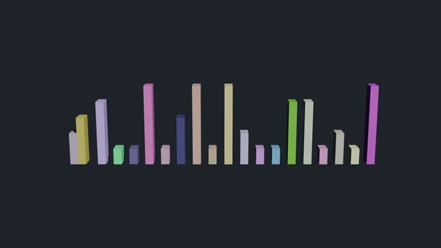
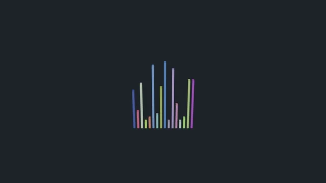

# Sorting algorithm visualisations in Blender

Bars of random height and colour, sorted by keyframed animation so the
algorithm's access pattern is something you watch rather than read.

## Bubble sort



Compares adjacent bars and swaps them when they are out of order. The pair being
compared flashes red, so the O(n²) sweep is visible as the red marker walking
the row again and again, one place shorter each pass. 20 bars, 1407 frames.

## Merge sort



Recursively splits the row into halves that move apart in 3D, then slides them
back together in order. The recursion depth is legible as physical distance: the
further a bar has travelled, the deeper the call that owns it. 16 bars, 801
frames.

Both previews are sped up and cut to 640 px. Full 1080p renders are attached to
the [latest release](https://github.com/Tewf/side-projects/releases/latest).

## Rendering them yourself

The scripts run inside Blender's Scripting workspace, and also headless:

```sh
blender --background --python bubble_sort.py -- --render --output out/bubble_sort.mp4 --seed 7
blender --background --python merge_sort.py  -- --render --output out/merge_sort.mp4  --seed 7
```

On a machine with a discrete GPU behind PRIME, prefix both with
`__NV_PRIME_RENDER_OFFLOAD=1 __GLX_VENDOR_LIBRARY_NAME=nvidia`. Blender takes
its GL context from the integrated GPU otherwise, which here is the difference
between four minutes and several hours.

Tested on Blender 5.2.0 LTS. Leave `--render` off to build the scene and stop,
which is what you want in the GUI.

| Flag | Default | |
|---|---|---|
| `--elements` | 20 bubble, 16 merge | Number of bars |
| `--sort-speed` | 10 | Frames per swap or per merged element |
| `--resolution` | `1920x1080` | |
| `--fps` | 24 | |
| `--seed` | random | Fixes the shuffle, so a render is reproducible |
| `--render` | off | Render, rather than only building the scene |

Note that both scripts clear the scene first, including the default camera and
light. `scene_setup.py` puts a camera and a key light back, framed on the whole
animation rather than on the opening layout, which matters for merge sort
because its halves travel a long way off the starting row.
