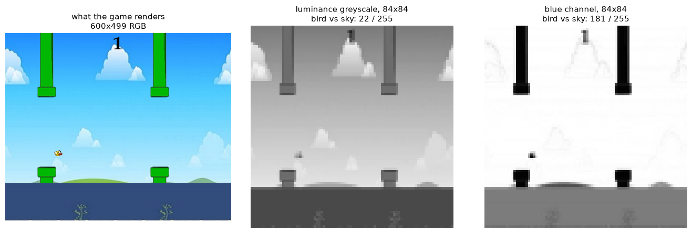
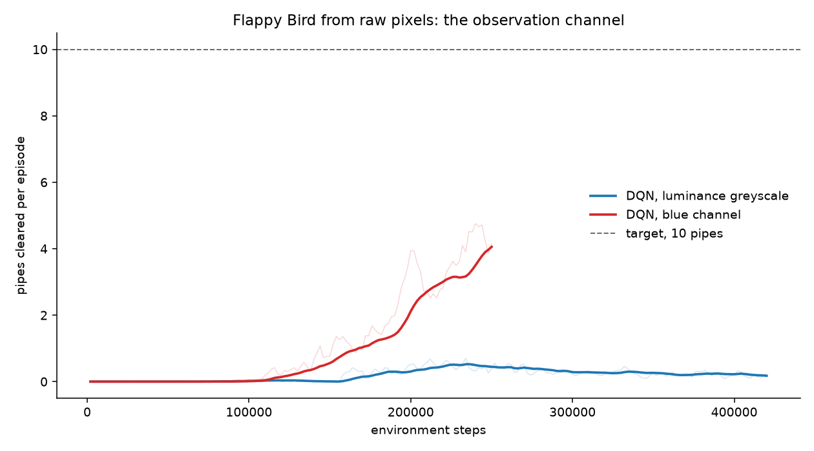
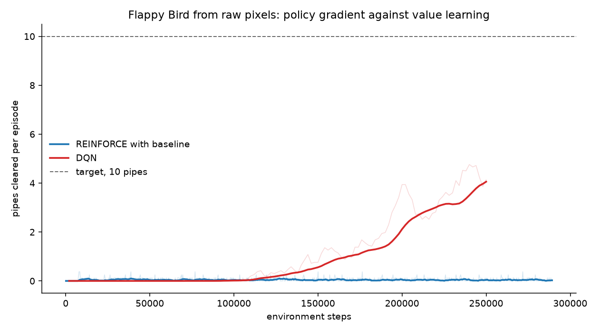

# Flappy Bird from raw pixels

Two agents learn to play from rendered frames alone: REINFORCE with a value
baseline, and a DQN for comparison. Neither is ever told the bird's position,
its velocity, or where the pipes are. The only input is four stacked 84x84
frames, and the only reward is +0.1 a frame alive, +1 a pipe, and -10 for dying.

## What the agent sees, and why it matters



The single largest gain in this project came from that middle-to-right change,
not from any hyperparameter. Reducing the frame to one channel is standard, and
the standard way is a luminance greyscale. But the bird is yellow and the sky is
light blue, and those are nearly equiluminant. Measured off the sprites, in
levels out of 255 against the sky:

| projection | bird vs sky | pipe vs sky |
|---|---|---|
| luminance greyscale | 22 | 64 |
| blue channel | **181** | **247** |

Greyscale was delivering the obstacles at three times the contrast of the bird
itself, which is the one object whose position the policy most needs. Taking the
blue channel instead costs nothing, and it also fades out the clouds that were
competing for attention at full contrast.

The effect on learning, with everything else held fixed, same seed and same
hyperparameters:



Greedy evaluation, 20 episodes at each point:

| environment steps | greyscale | blue channel |
|---|---|---|
| 25k | 0.00 | 0.00 |
| 50k | 0.00 | 0.40 |
| 100k | 0.00 | 1.00 |
| 150k | 0.00 | 1.00 |
| 200k | 0.55 | 2.20 |
| 225k | 0.35 | 5.35 |
| 250k | 0.40 | **12.65** |
| 375k | 0.80 | reached the target and stopped at 250k |

Greyscale needed 200k steps to clear its first pipe and never got past 0.80 in
420k. The blue channel cleared one at 50k and passed ten at 250k.

Both projections are fixed, hand-chosen reductions in exactly the sense
greyscaling is. The agent still receives nothing but rendered pixels.

## Frame stacking

The policy reads four consecutive frames, not one. A single frame shows where
the bird is but not which way it is moving, and in Flappy Bird the right action
at a given height depends almost entirely on velocity, so with one frame the
optimal policy is not a function of the observation and no amount of training
reaches it.

There is also a distance floor worth knowing before reading any learning curve:
the bird sits at x=120, the first pipe spawns at x=800 and closes at 4 px a
frame, so **170 frames, or 85 decisions at frame-skip 2, must be survived before
a pipe is reachable at all**. Every evaluation before an agent can stay up that
long reads 0.00 for reasons that have nothing to do with its ability to thread a
gap.

## Results


The DQN reached the 10-pipe target at 250,000 environment steps, 23 minutes of
training on an RTX 4060. Scored over **100 fresh episodes**, greedy:

| | pipes |
|---|---|
| mean | **12.21** |
| median | 8 |
| standard deviation | 12.63 |
| quartiles | 3 and 18 |
| range | 0 to 61 |
| cleared at least 1 pipe | 99% of episodes |
| cleared at least 10 | 41% |
| cleared at least 20 | 23% |

The mean is worth distrusting on its own here. The distribution has a long tail:
the median episode clears 8 pipes, but the best of the hundred cleared 61, and
that tail is what drags the mean above the median. The agent is competent rather
than reliable, and one episode in a hundred still ends without a single pipe.

### REINFORCE with a value baseline did not get there



Over 289,000 environment steps, more than the DQN needed, it never cleared a
single pipe in evaluation. Its episodes plateaued almost immediately and stayed
there, in decisions survived against the 85 a first pipe requires:

```
epochs   1-50   51-100  101-150  151-200  201-250  251-300  301-350  351-400
   42       48       46       50       48       45       48       49
```

The reason is structural rather than a matter of tuning. REINFORCE is on-policy
and Monte Carlo, so it makes one gradient update per batch of episodes, which
here is one update per roughly 380 environment steps. The DQN replays its buffer
and makes one update every 4 steps. Over comparable experience that is **756
updates against 61,250**, a factor of 81. Policy gradient without importance
sampling cannot reuse an episode once the policy has moved, and on this problem
that is the whole difference.

Worth being explicit about one thing, because it would otherwise read as a
result about the algorithm. An earlier version of this training loop used
`value_coef = 0.5` on unnormalised returns. The rewards here are +0.1 a frame,
+1 a pipe and -10 for dying, so returns reach about +-80 and the value loss
reached 21 while the policy loss sat near 0.05. With a shared trunk that made
the value term **224 times** the policy term, and the convolutions were being
trained almost entirely to regress returns. That coefficient is borrowed from
implementations which clip rewards to [-1, 1]. Standardising the returns before
either head sees them fixed the imbalance and visibly stabilised training,
entropy declining smoothly instead of oscillating between 0.01 and 0.69. It did
not change the outcome, and the numbers above are from the fixed version.

## The networks

Both share one trunk, so a difference between the curves is the algorithm rather
than the input.

```
Conv2d(4, 16, k8, s4, p2)   84 -> 21
Conv2d(16, 32, k4, s2, p1)  21 -> 10
Conv2d(32, 32, k3, s1, p1)  10 -> 10
Linear(3200, 256)
```

REINFORCE adds a policy head and a value head; DQN adds one head giving a Q
value per action. The value head is a baseline only: returns stay full Monte
Carlo, which makes it REINFORCE with baseline rather than actor-critic. Without
it the advantage is a single scalar per batch, which cannot tell a doomed state
from a promising one, so the update largely encodes where in the episode a step
happened rather than whether the action was good.

## Running it

```sh
pip install -r requirements.txt

python train.py --epochs 20000 --episodes-per-epoch 8 --lr 5e-4    # REINFORCE
python dqn.py   --steps 800000                                      # DQN
python eval.py  --checkpoint checkpoints/dqn/best.pt --episodes 20
python plot_results.py --out results/learning_curve.png
```

Add `--render` to `eval.py` to watch it in a window, or `--record out.webp` to
save the best episode. Training is headless; set `SDL_VIDEODRIVER=dummy` on a
machine with no display. Everything is seeded, so a run repeats given `--seed`.

| file | |
|---|---|
| `flappy_bird_env.py` | the Pygame game, and a generator interface for agents |
| `flappy_gym_env.py` | the Gymnasium environment and the observation pipeline |
| `networks.py` | the shared trunk, the actor-critic heads, the Q head |
| `train.py` | REINFORCE with a value baseline |
| `dqn.py` | DQN with replay, a target network and epsilon decay |
| `eval.py` | scores a checkpoint, optionally recording it |
| `plot_results.py` | both learning curves against environment steps |

## What this replaced

The earlier version of this project shipped a 10 MB checkpoint from a run that
never learned. Its policy read a single frame, so the task was not learnable as
posed; its own training log shows entropy collapsing by epoch 15 and reward
oscillating around zero for the next 985 epochs. Alongside that:

- `evaluate()` initialised `scores = []` and never appended to it, so it always
  returned an empty list and the README's own usage snippet divided by zero. No
  score for that agent had ever been recorded.
- The frame-rate cap sat inside the environment generator rather than around the
  rendering, holding every training step to 32 a second no matter how fast the
  policy ran. The environment now does 499.
- `init_pygame()` ran once per episode, recreating the window and reloading
  fifteen sprites, roughly 5,000 and 75,000 times over that run.
- `compute_returns` multiplied by `gamma**t` and divided it back out, which
  underflows in float32 and returns `inf` on long episodes, that is, precisely
  once an agent starts succeeding.

The old checkpoint is not migrated: its first convolution is shaped for one
input channel. It remains in git history.

## Licence

[MIT](../LICENSE)
