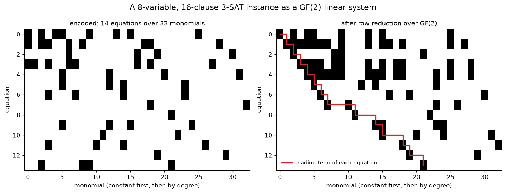
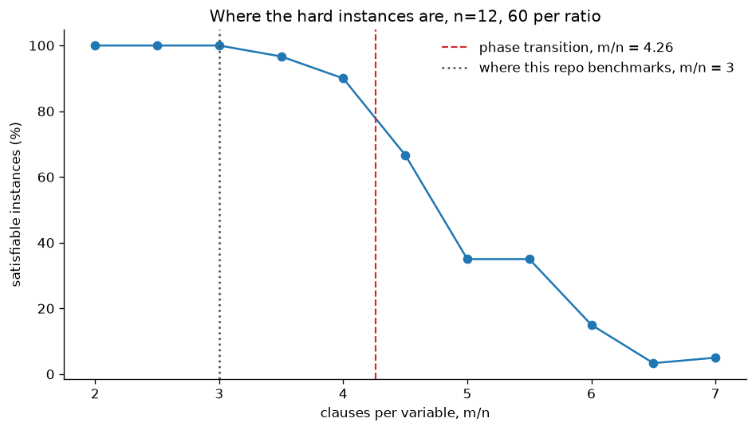
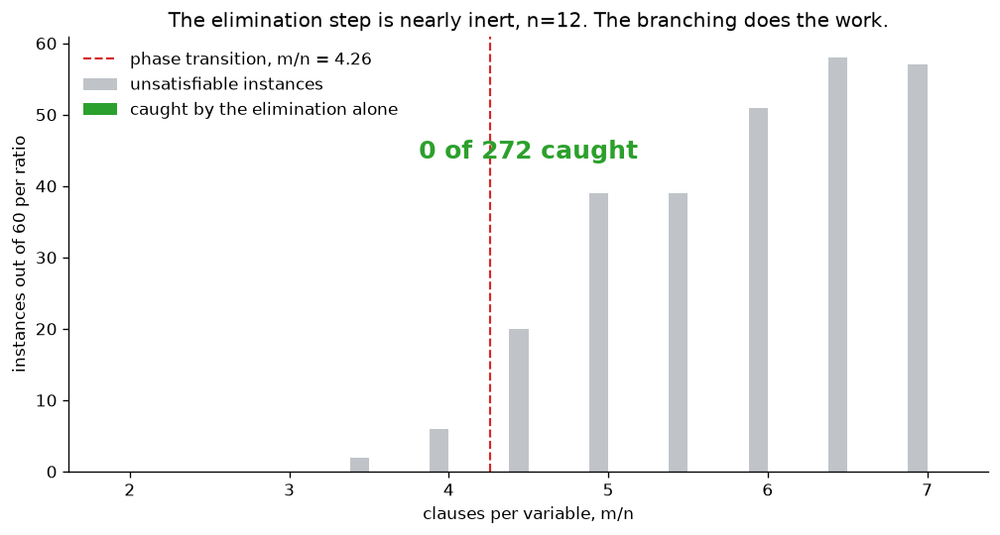

# Gröbner‐Basis 3-SAT Solver over GF(2)

A 3-SAT decision procedure built from scratch in Python. Clauses become
polynomials in the Boolean ring GF(2)[x₁,…,xₙ]/⟨xᵢ²−xᵢ⟩, where the satisfying
assignments are exactly the common zeros; triangular Gröbner-style elimination
propagates, and branching completes the search.

## The algebra, drawn



Each clause becomes one polynomial whose zeros are exactly the assignments
satisfying it. Treat every distinct monomial as an unknown and the whole system
is a matrix over GF(2): 14 equations over 33 monomials for the small instance
above. Row reduction pushes it into echelon form, and the red staircase is the
leading term of each equation, which is the triangular structure the method is
named for.

Both panels are produced by [`visualise.py`](visualise.py) from
`monomial_basis`, `system_to_matrix` and `gauss_elim_gf2` in
[`linear_algebra.py`](linear_algebra.py), so the picture is the same code path
the solver uses, not an illustration of it.

## Two things the pictures make harder to overstate



Random 3-SAT gets hard near m/n ≈ 4.26, and this repository benchmarks at 3.0,
where every one of 60 instances per ratio came back satisfiable. A high success
rate there measures the instance distribution, not the solver. The measured
crossing sits right of 4.26 because n=12 is small and the transition only
sharpens as n grows.



Across 272 genuinely unsatisfiable instances spanning m/n from 2 to 7, the
elimination step on its own caught **none**. It is sound, in that it never
claimed UNSAT on a satisfiable instance, and it is nearly inert. The branching
does the work.

Regenerate both with `python visualise.py`, about 80 seconds.

## What it does

* **Polynomial encoding** of 3-SAT clauses as GF(2) ideals with idempotence xᵢ² = xᵢ
* **Triangular Gröbner‐like basis** extraction via monomial elimination + local one-variable forcing
* **Recursive backtracking** interleaving elimination with branching on free variables
* **Solver wrapper** for stress-testing against a reference SAT solver (PySAT’s Minisat22)

## Layout

```
Groebner_Basis_SAT_Solver/
├── polynomial.py        # GF(2) Polynomial class + monomial operations
├── utils.py             # sat_to_polynomials, generate_3sat, verify_solution
├── solver.py            # triangular_Grobner_Basis, local_test, polynomial_Solver
├── linear_algebra.py    # GF(2) row echelon on the monomial-linearised system
│                        #   (sound, but measured useless -- see below)
├── test_bruteforce.py   # verification vs exhaustive search, no dependencies
├── tests.py             # cross-check vs PySAT's Minisat22
├── docs/                # the superseded 2023 write-up, and why it is wrong
└── README.md            # this document
```

## Quickstart

1. **Solve a random 3-SAT**

   ```python
   from utils import generate_3sat, sat_to_polynomials
   from solver import polynomial_Solver, UnsatError

   NUM_VARS, NUM_CLAUSES = 20, 60
   clauses = generate_3sat(NUM_VARS, NUM_CLAUSES, seed=42)
   polys   = sat_to_polynomials(clauses, NUM_VARS)

   solution = polynomial_Solver(polys, NUM_VARS)
   if solution is None:
       print("UNSAT")
   else:
       print("SAT!  Assignment:", solution)
   ```

2. **Run the test suite**

   ```bash
   python test_bruteforce.py   # no dependencies: checks against exhaustive search
   python tests.py             # cross-check against MiniSat (needs python-sat)
   ```

   `test_bruteforce.py` is the stricter of the two: for a SAT verdict it
   validates the returned assignment, not just the verdict.

## How it works

### 1. Encoding 3-SAT → GF(2) Polynomials

Each clause $(ℓ₁∨ℓ₂∨-ℓ₃)$ becomes

$$
  (1+x_1)\,(1+x_2)\,x_3 = 0
$$

in GF(2), with $x_i=1$ for a positive literal and omitted for a negation.

### 2. Triangular Elimination & Local Test  
- **`triangular_Grobner_Basis(polys, var_assign)`**  
  1. Selects the “largest” polynomial \(p\).  
  2. Extracts its leading monomial \(M\) and remainder \(L(x)\) so that \(p(x)=M+L(x)=0\).  
  3. **Records this monomial→polynomial reduction** \((M,L)\).  
  4. Substitutes \(M→L\) into every other polynomial via `inject_monomial`, propagating that “solved” relation globally.  
  5. Applies `local_test()` to force any single-variable assignments.  
- **`local_test(poly, var_assign)`**  
  Randomly picks a variable in `poly`, tries setting it to 1 then 0; if that yields a contradiction \(1=0\), forces the opposite assignment and recurses.

### 3. Recursive Solver
Once no more forced consequences remain, if not all variables are assigned,
`polynomial_Solver` picks a free variable, substitutes both values into the
**current system** and recurses. It deliberately does *not* branch on the
returned basis: that basis holds only the pivots popped during elimination, so
every constraint rewritten into another polynomial along the way would be lost.

## What the numbers say

Numbers below are measured, not estimated. Ground truth for $n\le14$ is
exhaustive enumeration of all $2^n$ assignments, which checks the returned
*assignment* and not merely the SAT/UNSAT verdict.

* **Correctness**
  * 500 instances at $8 \leq n \leq 12$: **0** wrong verdicts, **0** invalid
    assignments. This is what `test_bruteforce.py` runs, in about 28 s.
  * 20 000 instances at $n=20,\;m=60$: every SAT verdict came with an assignment
    that verifies. This is what `tests.py` runs, cross-checked against PySAT
    rather than against exhaustive search, which is infeasible at $n=20$.

* **The elimination step alone is sound but weak.** It never claims UNSAT on a
  satisfiable instance (0 unsound claims in every run), but it rarely claims
  anything at all. Across 285 genuinely-UNSAT instances at $10 \leq n \leq 14$ it
  flagged **1**. At $n=20,\;m=60$ it resolves **0.00 %** of systems on its own.
  Essentially all the work is done by the branching.

* **A note on the benchmark ratio.** $m/n = 3.0$ sits well below the random
  3-SAT phase transition at $\alpha \approx 4.26$, so ~99.95 % of instances
  generated there are satisfiable. A high success rate at that ratio measures
  the instance distribution, not the solver. Harder instances live near
  $m/n \approx 4.26$; at $n=10,\;m=43$ this solver still agrees with exhaustive
  search on every instance, but the elimination step contributes nothing.

* **Incomplete “triangular” basis**
  `triangular_Grobner_Basis` does *not* compute full S-polynomials, so it does
  not guarantee a true Gröbner basis. It produces a set of polynomials where no
  one can be algebraically expressed *solely* in terms of the others by basic
  GF(2) arithmetic, which is why it is a weak UNSAT detector rather than a
  decision procedure.

* **Complexity**
  * `triangular_Grobner_Basis` is **polynomial** in $n$.
  * `polynomial_Solver` is worst-case **exponential** in $n$, because arbitrary
    3-SAT is NP-complete. No amount of algebraic preprocessing changes that.

## Where it could go next

* **Make the elimination earn its place.** Right now it is nearly inert.
  Row-reducing the whole system over GF(2) was the obvious candidate: it catches
  contradictions needing several equations XORed together, which the
  per-polynomial $1=0$ check cannot see. It is implemented in
  `linear_algebra.py` and it does not help: across 258 unsatisfiable instances it
  found exactly as many as the cheap check, none. Something stronger is needed.
* **Stronger propagation**: “monomial forced to 1 ⇒ every variable in it is 1”
  is deterministic and strictly stronger than the current single-random-variable
  forcing in `local_test`.
* **Term-order Variants**: experiment with lex, graded-lex, etc.
* **Benchmark at the phase transition** ($m/n \approx 4.26$) rather than at 3.0.

---
