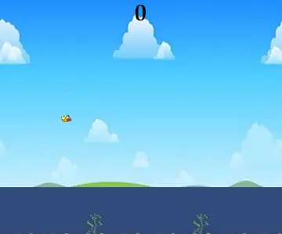

# after-hours

[](https://github.com/Tewf/after-hours/actions/workflows/ci.yml)
[](https://tewf.github.io/after-hours/index.fr.html)
[](LICENSE)

> [Read in English](README.md)



Ce que je construis quand je m'ennuie. Personne ne me l'a demandé et rien ici
n'est un devoir : c'est ce que je fais d'une soirée libre, en apprentissage
automatique, calcul formel et mathématiques appliquées.

Chaque dossier est autonome, avec son propre README et ses propres dépendances.
Chaque chiffre ci-dessous est produit par du code de ce dépôt, et la
[CI](https://github.com/Tewf/after-hours/actions/workflows/ci.yml) rejoue les
vérifications à chaque push.

| | De quoi il s'agit | Ce que ça donne |
|---|---|---|
| **[Flappy Bird à partir des pixels bruts](Flappy_Bird_CNN/)** | Un DQN et un agent REINFORCE qui ne voient que l'image rendue. Ni position, ni vitesse, ni coordonnées des tuyaux | **12,21 tuyaux** par épisode sur 100 épisodes déterministes, record 61, entraîné en **23 minutes** sur une seule RTX 4060 |
| **[Solveur 3-SAT sur GF(2)](Groebner_Basis_SAT_Solver/)** | Les clauses deviennent des polynômes, une élimination triangulaire à la Gröbner propage, le branchement termine | **0 verdict faux** sur 500 instances confrontées à une recherche exhaustive, et il dit franchement laquelle de ses deux moitiés fait le travail |
| **[Algorithmes de tri en 3D](Blender_Python_Scripts/)** | Tri à bulles et tri fusion, animés par images clés et rendus via l'API Python de Blender | **1407 et 801 images** en 1080p24, rendues sans interface en 4 et 2 minutes |
| **[Algorithmes matriciels de zéro](Linear_Algebra/)** | Une FFT, un déterminant, un inverse exact et une trace, chacun réécrit plutôt qu'appelé | **11 vérifications** contre numpy, concordance à 1e-13. NumPy sert d'oracle, jamais d'implémentation |
| **[L'impôt français, modélisé](Taxes/)** | Ajustements exponentiels par tranche, puis la fonction W de Lambert pour trouver où le taux effectif cesse d'accélérer | Le point de bascule est à **59 800 €** de brut annuel |

## Celui que je montrerais en premier

L'agent Flappy Bird a stagné longtemps et aucun hyperparamètre n'y changeait
rien. L'oiseau est jaune, le ciel bleu clair, et les deux sont presque
équiluminants : la conversion en niveaux de gris que tout pipeline Atari utilise
donnait à l'oiseau **22 niveaux de contraste sur 255**, contre 64 aux tuyaux.
Prendre le canal bleu en donne 181.

Même réseau, mêmes hyperparamètres, même graine : en niveaux de gris il a fallu
200k pas pour franchir un premier tuyau et le score n'a jamais dépassé 0,80 ; en
canal bleu, un tuyau à 50k pas et dix à 250k.
[Le compte rendu est ici](Flappy_Bird_CNN/), y compris la tentative qui a échoué
et une erreur d'échelle de ma part qui rendait la perte de valeur 224 fois plus
grande que celle de la politique.

## Lancer l'un d'eux

```sh
cd <dossier>
pip install -r requirements.txt
```

Le README de chaque dossier indique quoi y lancer. Les scripts Blender se
chargent dans l'espace de travail Scripting, ou se rendent sans interface depuis
la ligne de commande. Les poids entraînés et les rendus pleine résolution sont
attachés à la
[dernière release](https://github.com/Tewf/after-hours/releases/latest) plutôt
que versionnés, pour qu'un clone reste léger.

## Licence

[MIT](LICENSE)
