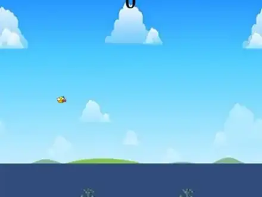
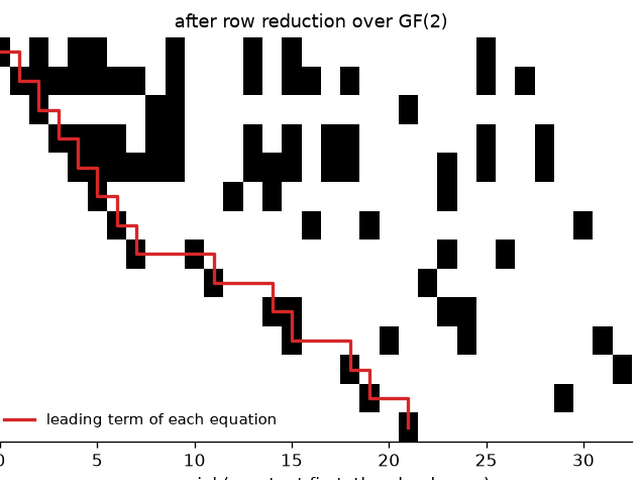
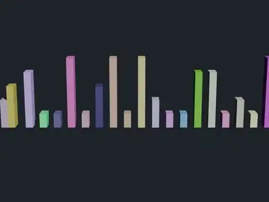
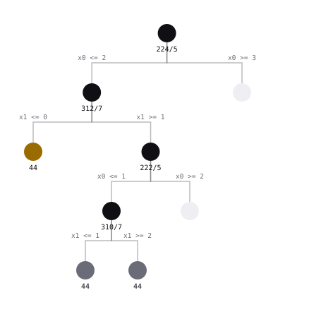
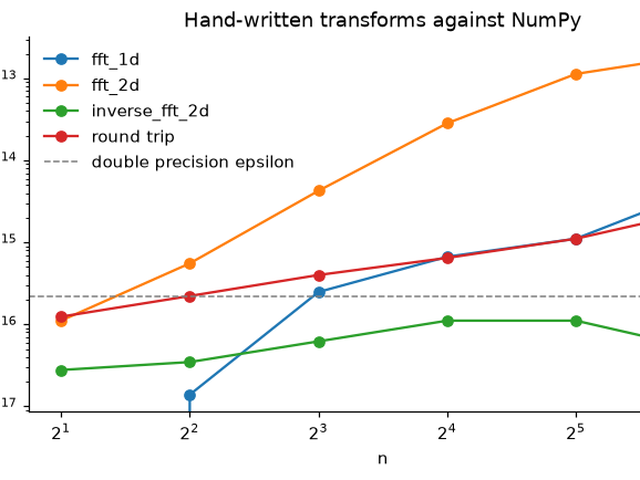
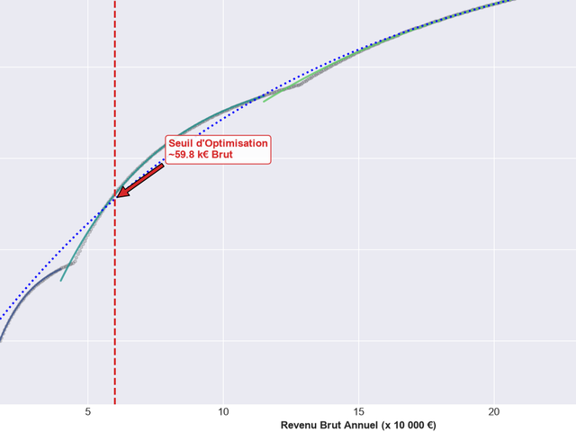

# after-hours

[](https://github.com/Tewf/after-hours/actions/workflows/ci.yml)
[](https://tewf.github.io/after-hours/index.fr.html)
[](LICENSE)

> [Read in English](README.md)

> [!TIP]
> **Tout est consultable comme un site :
> [tewf.github.io/after-hours](https://tewf.github.io/after-hours/index.fr.html)**
> Chaque projet sur une seule page, animations et graphiques en pleine taille,
> et le rapport fiscal lisible dans le navigateur plutôt qu'en PDF à télécharger.

Ce que je construis quand je m'ennuie. Personne ne me l'a demandé et rien ici
n'est un devoir : c'est ce que je fais d'une soirée libre, en apprentissage
automatique, calcul formel et mathématiques appliquées.

Chaque dossier est autonome, avec son propre README et ses propres dépendances.
Chaque chiffre ci-dessous est produit par du code de ce dépôt, et la
[CI](https://github.com/Tewf/after-hours/actions/workflows/ci.yml) rejoue les
vérifications à chaque push.

| | |
|---|---|
|  | **[Flappy Bird à partir des pixels bruts](Flappy_Bird_CNN/)**<br><br>Un DQN et un agent REINFORCE qui ne voient que l'image rendue. Ni position, ni vitesse, ni coordonnées des tuyaux.<br><br>**12,21 tuyaux** par épisode sur 100 épisodes déterministes, record 61, entraîné en **23 minutes** sur une seule RTX 4060.<br><br>*PyTorch, Gymnasium, Pygame* |
|  | **[Un solveur 3-SAT sur GF(2)](Groebner_Basis_SAT_Solver/)**<br><br>Les clauses deviennent des polynômes, une élimination triangulaire à la Gröbner propage, le branchement termine. Chaque monôme distinct devient une inconnue, et le système devient une matrice.<br><br>**0 verdict faux** sur 500 instances confrontées à une recherche exhaustive, et il dit franchement laquelle de ses deux moitiés fait le travail.<br><br>*Python, PySAT pour la vérification croisée* |
|  | **[Algorithmes de tri en 3D](Blender_Python_Scripts/)**<br><br>Tri à bulles et tri fusion, animés par images clés et rendus via l'API Python de Blender, pour que le schéma d'accès se regarde au lieu de se lire.<br><br>**306 et 206 événements**, transcrits en 1161 et 841 images en 1080p24. Les aperçus ici proviennent du rendu précédent, avant que le minutage ne sorte de l'algorithme.<br><br>*Blender 5.2, bpy* |
|  | **[Programmation en nombres entiers, exactement](Integer_Programming/)**<br><br>Un simplexe en deux phases sur des rationnels exacts, puis séparation et évaluation sur ce qu'il laisse fractionnaire. Rien n'est jamais un flottant : une borne est donc un fait sur le programme et non sur l'arithmétique.<br><br>**200 programmes tirés au hasard** donnent le même optimum qu'une énumération de tous les points entiers de la boîte. Le sac à dos ci-dessus tient en **9 nœuds**.<br><br>*Python, fractions* |
|  | **[Algorithmes matriciels de zéro](Linear_Algebra/)**<br><br>Une FFT, un déterminant par complément de Schur, un inverse entier exact et une trace qui ne forme jamais le produit. NumPy sert d'oracle, jamais d'implémentation.<br><br>**11 vérifications** contre NumPy, concordance à 1e-13. L'inverse est exact et non approché.<br><br>*Python, NumPy* |
|  | **[L'impôt français, modélisé](Taxes/)**<br><br>À partir de quand un euro brut supplémentaire cesse-t-il de rapporter beaucoup ? Ajustements exponentiels par tranche, puis la fonction W de Lambert pour trouver où le taux effectif cesse d'accélérer.<br><br>Le point de bascule est à **59 800 €** de brut annuel.<br><br>*SciPy, Quarto* |

## Regarder ce que le réseau reçoit vraiment

La leçon qui a coûté le plus de temps ici, et la seule qui se transpose. L'agent
Flappy Bird a stagné et aucun hyperparamètre n'y changeait rien. L'oiseau est
jaune, le ciel bleu clair, et les deux sont presque équiluminants : la conversion
en niveaux de gris que tout pipeline Atari utilise donnait à l'oiseau **22
niveaux de contraste sur 255**, contre 64 aux obstacles. Prendre le canal bleu en
donne 181.

Même réseau, mêmes hyperparamètres, même graine : en niveaux de gris il a fallu
200k pas pour franchir un premier tuyau et le score n'a jamais dépassé 0,80 ; en
canal bleu, un tuyau à 50k pas et dix à 250k. Cela a longtemps ressemblé à un
problème de réglage, et ça n'en a jamais été un.
[Le compte rendu est ici](Flappy_Bird_CNN/), avec la tentative qui a échoué et
une erreur d'échelle de ma part qui rendait un terme de perte 224 fois plus grand
qu'un autre.

## Lancer l'un d'eux

```sh
cd <dossier>
pip install -r requirements.txt
```

Le README de chaque dossier indique quoi y lancer. Les scripts Blender se
chargent dans l'espace de travail Scripting, ou se rendent sans interface depuis
la ligne de commande. Les poids entraînés et les rendus pleine résolution sont
attachés à la
[dernière release](https://github.com/Tewf/after-hours/releases/latest) plutôt
que versionnés, pour qu'un clone reste léger.

## Licence

[MIT](LICENSE)
