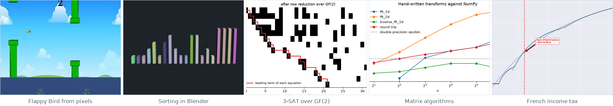

# after-hours

[](https://github.com/Tewf/after-hours/actions/workflows/ci.yml)
[](https://tewf.github.io/after-hours/)
[](LICENSE)

> [Lire en français](README.fr.md)



What I build when I am bored. Nobody assigned any of it and none of it is
coursework: it is what I do with a free evening, in machine learning, computer
algebra and applied mathematics.

Each folder stands alone, with its own README and its own dependencies. Every
number below is produced by code in this repository, and
[CI](https://github.com/Tewf/after-hours/actions/workflows/ci.yml) reruns the
checks on every push.

| | What it is | What it does |
|---|---|---|
| **[Flappy Bird from raw pixels](Flappy_Bird_CNN/)** | A DQN and a REINFORCE agent that see nothing but the rendered frame. No position, no velocity, no pipe coordinates | **12.21 pipes** per episode over 100 greedy episodes, best 61, trained in **23 minutes** on one RTX 4060 |
| **[3-SAT solver over GF(2)](Groebner_Basis_SAT_Solver/)** | Clauses become polynomials, triangular Gröbner-style elimination propagates, branching finishes | **0 wrong verdicts** on 500 instances checked against exhaustive search, and it says plainly which half of it does the work |
| **[Sorting algorithms in 3D](Blender_Python_Scripts/)** | Bubble and merge sort keyframed and rendered through Blender's Python API | **1407 and 801 frames** at 1080p24, rendered headless in 4 and 2 minutes |
| **[Matrix algorithms from scratch](Linear_Algebra/)** | An FFT, a determinant, an exact inverse and a trace, each written out rather than called | **11 checks** against numpy, matching to 1e-13. NumPy is the oracle, never the implementation |
| **[The French income tax, modelled](Taxes/)** | Exponential fits per bracket, then the Lambert W function to find where the effective rate stops accelerating | The tipping point is **59 800 EUR** gross a year |

## Look at what the network actually receives

The lesson that cost the most time here, and the one that transfers. The Flappy
Bird agent plateaued and no hyperparameter moved it. The bird is yellow, the sky
is light blue, and the two are nearly equiluminant, so the luminance greyscale
every Atari pipeline uses was giving the bird **22 levels of contrast out of
255** while the obstacles got 64. Taking the blue channel instead gives 181.

Same network, same hyperparameters, same seed: greyscale needed 200k steps to
clear its first pipe and never passed 0.80; the blue channel cleared one at 50k
and passed ten at 250k. It looked like a tuning problem for a long time, and it
was never a tuning problem. [The write-up is
here](Flappy_Bird_CNN/), with the run that failed and a scaling bug of mine that
made one loss term 224 times another.

## Running any of them

```sh
cd <folder>
pip install -r requirements.txt
```

Each folder's README says what to run. The Blender scripts load in Blender's
Scripting workspace or render headless from the command line. Trained weights
and the full-resolution renders are attached to the
[latest release](https://github.com/Tewf/after-hours/releases/latest) rather
than committed, so a clone stays small.

## Licence

[MIT](LICENSE)
