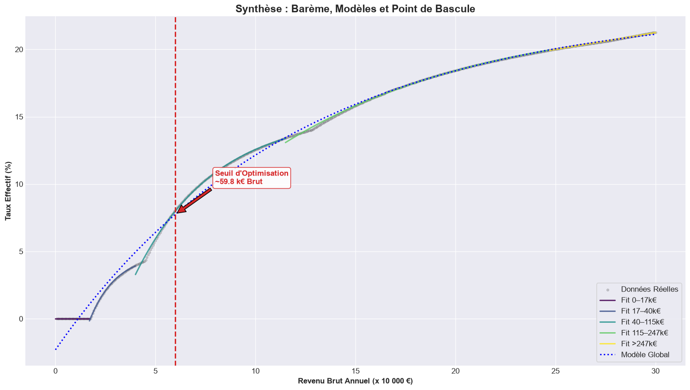

# The French income tax, modelled



Where does an extra euro of gross salary stop being worth much? The bracket
schedule is a staircase, but the rate anyone actually pays is a smooth curve
underneath it, and that curve has a point where its slope stops growing.

Fitting the effective rate as `a0 + a1 * exp(a2 * x)` and solving `tau'(x)` for
its inflection needs the Lambert W function, because the equation is of the form
`v * exp(v) = c`. Both branches are computed and the one that lands inside the
income range is kept.

**The answer is about 59 800 EUR gross a year.** Before it, each raise is
proportionally expensive; after it, the effective rate keeps climbing but its
derivative flattens.

The write-up is in French: [`taxes.qmd`](taxes.qmd) is the source,
[`taxes.pdf`](taxes.pdf) and [`taxes.html`](taxes.html) are the two rendered
forms, and both come out of the same file.

## Rendering it

```sh
pip install -r requirements.txt
quarto render taxes.qmd --to html      # taxes.html
quarto render taxes.qmd --to typst     # taxes.pdf, A4
```

Tested on Quarto 1.8.26. Both commands regenerate the figures used above.

## What was wrong before

The command in this README could not produce the file next to it. The YAML
declared HTML only, while the committed PDF had been made by Typst at US letter
size in a French fiscal document, and it referenced a `styles.css` that does not
exist in the repository, so the documented command failed before rendering
anything. Both formats are declared now and both are produced from this source.

Three things in the write-up itself:

- **A sign error in the central argument.** The text concluded `tau'(x) < 0` from
  `a1 < 0` and `a2 < 0`, but the product of two negatives is positive, so
  `tau' > 0`. The rate rises toward its asymptote, which is what progressivity
  means and what both figures had been showing all along. The code was right;
  only the paragraph justifying it was wrong, and it sat under a heading reading
  "Justification mathématique".
- **Two bracket thresholds were transposed.** `11994` for `11294` and `82441`
  for `82341`, in a constant labelled as the official schedule. Correcting them
  moved the tipping point from 62 114 EUR to **59 800 EUR**, which is why that
  number differs from earlier versions of this repository.
- **Three of the five zone fits do not produce a usable threshold** and were
  being printed as though they did, including one negative value obtained by
  taking the larger of two negatives. They are marked `NaN` now, with a note in
  the document explaining why the `0-17k` zone degenerates and why the
  conclusion rests on the global model.

## Licence

[MIT](../LICENSE)
